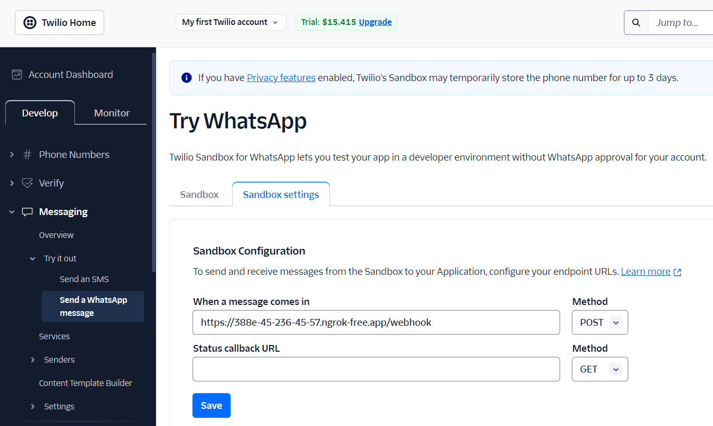

# PIRI: Atención prenatal, apoyo total.

<div style="text-align: center;">
  
</div>

## Desarrollo  

### 1. Crear cuentas en OpenAI y Twilio  

#### OpenAI  
1. Ir a [OpenAI](https://platform.openai.com/signup/) y crear una cuenta.  
2. Generar una clave API en la sección **API Keys** del panel de OpenAI.  

#### Twilio  
1. Ir a [Twilio](https://www.twilio.com/try-twilio) y registrarse.  
2. En el panel de Twilio, obtener las credenciales necesarias:  
   - **Account SID**  
   - **Auth Token**  

### 2. Configurar variables de entorno  

Para evitar exponer credenciales en el código, configura las variables de entorno en tu sistema.  

#### En **Windows (PowerShell)**  

Ejecuta los siguientes comandos en PowerShell:  

```powershell
$env:OPENAI_API_KEY="tu_openai_api_key"
$env:TWILIO_ACCOUNT_SID="tu_twilio_account_sid"
$env:TWILIO_AUTH_TOKEN="tu_twilio_auth_token"
```


### 3. Configuración de Ngrok  

Ngrok permite exponer un servidor local a Internet mediante un túnel seguro.  

#### Crear una cuenta en Ngrok  

1. Ir a [Ngrok](https://dashboard.ngrok.com/signup) y registrarse.  
2. Obtener el **Auth Token** desde el panel de usuario.  
3. Configurar Ngrok con el token de autenticación:  

   ```bash
   ngrok config add-authtoken TU_NGROK_AUTHTOKEN
   ```

### 4. Instalación de dependencias  

Antes de iniciar el desarrollo, instala las dependencias necesarias ejecutando el siguiente comando:  

```bash
pip install twilio openai flask ngrok
```

### 5. Levantar el servidor  

Para ejecutar la aplicación, sigue estos pasos:  

#### Iniciar el servidor Flask  

Ejecuta el siguiente comando para levantar el servidor local:  

```bash
python app.py
```

#### Exponer el servidor con Ngrok
Abre otra terminal y ejecuta el siguiente comando para generar una URL pública:
```bash
ngrok http 5000
```

#### Obtener la URL de Ngrok
Una vez iniciado Ngrok, se generará una URL similar a la siguiente:


```
https://9452-45-236-45-57.ngrok-free.app
```

Guarda esta URL, ya que será necesaria para configurar el webhook en Twilio




